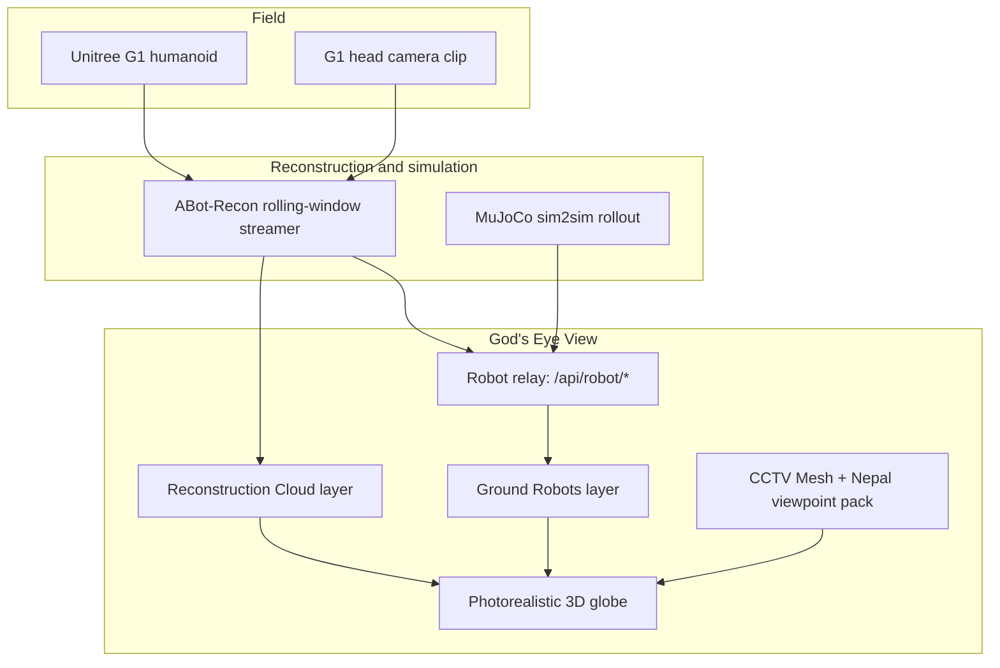

<div align="center">

# Fo Guang: Buddha's Light — #savenepal

### A disaster-response viewer built on top of God's Eye View: street-level eyes where no camera network exists, and a humanoid that can walk in where people cannot.

*No place left behind — including the places nobody instrumented.*

</div>

---

## Why this exists

When a monsoon flood takes out the Pasang Lhamu Highway or a quake shakes the
Kathmandu valley, the first question is the cheapest one to ask and the hardest
one to answer: **what does the ground look like right now?**

Nepal has almost no ingestable public sensing. There is no city camera API to
poll: Windy's webcam API is key-gated, OpenStreetMap carries 14
`man_made=surveillance` nodes in the Kathmandu valley with no feeds behind
them, and the aggregators advertising "1,000+ Nepal traffic cameras" serve dead
links. The nearest live pack God's Eye View can actually ingest is London —
7,285 km from the Rasuwagadhi flood corridor.

So this stack does not pretend a feed exists. It does three honest things
instead:

1. **Stands up street-level viewpoints** on the two corridors that matter, and
   renders Google Street View imagery through them where no live camera exists.
2. **Sends a robot instead of a camera** — a Unitree G1 humanoid whose real
   telemetry drives a marker, a gait animation, and a third-person chase camera
   on the photorealistic globe.
3. **Reconstructs the ground it walked** — an ABot-Recon point cloud from the
   robot's own head camera, replayed on the globe along the trajectory that
   produced it.

Every one of those three is labelled for exactly what it is. This project
inherits God's Eye View's rule and tightens it: **a viewer who reads only the
chips must come away with a correct understanding.** If someone could mistake
this for a live robot standing in Nepal, the labelling has failed — not the
disclaimer.

> **Read this first:** God's Eye View is an exploratory visualization of public
> and third-party data. Nothing in this stack — including everything below — is
> validated for emergency response, navigation, or any other safety-critical
> use. It is a foundation for building that, not a substitute for it.

---

## The mission stack



---

## 1. Street-level eyes on two corridors

The Nepal viewpoint pack (`config/cctv_sources.nepal.json`, loaded by
`loadNepalViewpointPack` in `server/proxies.js`) ships **77 curated
street-level viewpoints** cut from OpenStreetMap road geometry:

| Run | OSM ref | Spacing | `cityId` | Viewpoints |
| --- | --- | --- | --- | --- |
| Kathmandu Ring Road | `NH39` | 350 m | `kathmandu` | 59 |
| Pasang Lhamu Highway — Betrawati to Rasuwagadhi (flood corridor) | `NH18`, `29A005` | 1,200 m | `rasuwagadhi` | 18 |

**They are viewpoints, not cameras.** Each entry is a real pose on a real
carriageway — lat/lon snapped onto a panorama's own coordinates, heading taken
from the local road tangent, ground elevation read from Open-Meteo so the
projected cone lands on the road rather than under the terrain. Entries are
deliberately feedless (no `url`, no `snapshotUrl`), so `/api/cctv/frame/:id`
finds no upstream and falls through to its existing Street View fallback,
rendering the pano at the viewpoint's own `headingDeg` / `pitchDeg` / `fovDeg`.
Nothing in the client had to change: the pack merges into `/api/cctv/sources`
alongside the live packs and projects through the same CCTV Mesh.

Operational properties that matter in a response context:

- **The pack never claims imagery that does not exist.** The generator
  (`scripts/build-cctv-pack-nepal.mjs`) probes every candidate against the
  Street View *metadata* endpoint — unbilled — and drops anything that is not
  `OK` before the pack is committed.
- **It is priced and capped.** Frames are billed Street View Static requests
  against `GOOGLE_MAPS_API_KEY`, one per camera refresh; `CCTV_NEPAL_ENABLED=0`
  drops the pack without touching the live packs, and the catalog cap keeps
  operator-configured cameras ahead of the Nepal pack and the Nepal pack ahead
  of the live city packs.
- **Attribution rides with each entry** (`Imagery © Google — Street View Static
  API`) and is surfaced in the camera card.
- **Pinned by tests.** `src/data/nepalViewpointPack.test.mjs` asserts every
  viewpoint is inside Nepal's bounding box, posed on the ground with a finite
  elevation, looking *down* the road, carrying no feed URL, uniquely
  identified, with both road runs represented and the cap ordering intact.

Details and regeneration: [`docs/cctv-nepal-pack.md`](docs/cctv-nepal-pack.md).

---

## 2. A humanoid on the globe

The **Ground Robots** layer (`src/data/groundRobots.js`) renders humanoid
telemetry as a first-class live layer: interpolated one telemetry interval
behind wall clock between real fixes, bounded coasting past the newest fix so a
stale robot *freezes rather than drifts*, ground height from a cached ground
snap against the rendered surface, and a provenance chip on every surface.

- **RobotFrame v1** (`src/data/robotFrame.js`) is the single wire contract
  shared by the bridge, the relay, and the layer: pose plus datum
  (`wgs84-ellipsoid` / `egm96-orthometric` / `agl` / `slam-local`), fix source,
  gait FSM, velocity, power, and a mandatory `provenance` block whose label
  must match its source (`live-g1` → `LIVE`, `synthetic` → `SIMULATED`, …).
- **Third-person chase camera** (`src/robotChaseCamera.js`) — 2–40 m range,
  −15° pitch, 60°/s yaw slew, terrain-safe anchor, posed from
  `scene.preUpdate`, and it holds the render governor for exactly the lifetime
  of the loop.
- **Gait animation** (`src/data/robotGaitPose.js`) poses the bundled
  `unitree-g1.glb` from the frame's gait FSM, cadence, and optional stride
  phase — a readable walk cycle within the Menagerie MJCF joint limits, not a
  physics replay. The wire format carries no joint angles, and the 3D-model
  handoff itself is the layer's optional `models3d` path (default off; the
  billboard glyph is the baseline).
- **▶ G1 DEMO** (`src/data/robotSyntheticWalker.js` generator, pill in
  `src/robotDemo.js`) runs the deterministic synthetic walker in the browser at
  10 Hz with no bridge and no relay process, streams frames through the layer's
  own `ingestLocalFrames()`, engages the chase camera, and opens a live
  telemetry panel. Same code path as relayed telemetry, provenance exactly
  `SIMULATED`.

**Read-only by construction.** `POST /api/robot/command` answers 501 and is
disabled by default; the live bridge provider's only input is a directory of
files and it registers no controller. Nothing in this stack can move a robot.

---

## 3. Reconstructing the ground it walked

**▶ DISASTER RECON** (`src/data/reconstructionCloud.js`, pill in
`src/robotDemo.js`) replays a real
[ABot-Recon](https://github.com/gratitude5dee/ABot-Recon) reconstruction of a G1
head-camera clip: the browser parses the exporter's binary PLY and
`camera_poses.npy` directly, decimates to a 220k point-primitive budget, rotates
cloud and trajectory out of ABot-Recon's camera frame into the anchor's local
ENU frame, and walks the robot marker along the recorded trajectory while the
cloud reveals the matching prefix — so the map grows as the robot walks it.

A reconstruction is **metric but ungeoreferenced** — its origin is the first
camera — so `config/recon/g1-anchor.json` supplies the lat/lon, heading, and
ground-relative elevation that say where on Earth to put it, on the
`slam-local` datum. Recorded geometry, chosen place, never live hardware: the
replay stays `SIMULATED · VIRTUAL TRANSPOSITION`.

> **The PLY and pose assets are not committed.** They are session artifacts
> sized in tens to hundreds of megabytes; see
> [`public/recon/README.md`](public/recon/README.md) for how to produce them.
> Without them the pill reports `NO RECONSTRUCTION PUBLISHED` and changes
> nothing else.

---

## 4. Live, and simulated, and honest about which

Two providers feed the same relay and the same layer:

- **Live Unitree bridge** (`tools/robot-bridge/providers/unitree.mjs`) tails
  the `pose_latest.json` that ABot-Recon's `scripts/stream_reconstruction.py`
  rewrites atomically after each rolling reconstruction window, emits one frame
  per new `seq`, and normalizes it through `src/data/unitreeTelemetry.js` into a
  `slam-local` frame with `LIVE` provenance and `transposed: true` — the motion
  is real, the geolocation is an editorial choice. Point batches never cross
  the bridge (`/api/robot/ingest` caps a body at 256 KB); the reconstruction
  layer loads them directly.
- **MuJoCo sim2sim** — `mujoco_playground`'s
  `experimental/sim2sim/robotframe_exporter.py` writes JSON Lines that
  `src/data/mujocoTelemetry.js` folds into canonical frames, deriving speed and
  course from the pelvis-frame linear velocity the G1 joystick policy itself
  observes. The raw policy observation is deliberately not forwarded.

**Degraded hosts stay quiet rather than lying.** On a serverless deploy with no
persistent relay, `/api/robot/telemetry` answers `503 {"status":"unsupported"}`;
the layer records that as `relayUnsupported`, closes the SSE stream, stops
re-polling, and shows no spurious `LOAD FAILED` chip. Local demo frames are
unaffected, and a later successful snapshot clears the flag.

---

## 5. Atmosphere, ported

`src/cockpitAtmosphere.js` ports the atmospheric terms of
[three-geospatial](https://github.com/gratitude5dee/three-geospatial)'s
`@takram/three-atmosphere` in spirit: NOAA solar position, Kasten–Young air
mass, closed-form Rayleigh transmittance for sun and sky radiance, and
altitude-dependent aerial-perspective weights. Cesium still owns the sky and
terrain — these helpers shade only the transparent cockpit cloud overlay, which
is why the expensive precomputed LUTs are replaced with closed-form
approximations.

---

## The honesty table

| Element | Status | Shown as |
|---|---|---|
| Kathmandu / Rasuwagadhi terrain and elevation | Real (Google 3D Tiles) | `LIVE` |
| Nepal viewpoint poses | Real road poses, verified panorama coverage | Street-level viewpoint, `Imagery © Google` |
| Nepal viewpoint frames | Street View imagery, not a live feed | camera card names the provider and imagery date |
| G1 gait, IMU, battery, temps (live bridge) | Real, from the robot | `LIVE` |
| ABot-Recon point cloud and trajectory | Real recorded geometry | `SIMULATED · VIRTUAL TRANSPOSITION` |
| Robot's geographic position | Staged onto an editorial anchor | `VIRTUAL TRANSPOSITION` |
| G1 DEMO telemetry | Deterministic synthetic walker | `SIMULATED` |
| Outbound robot commands | Not implemented; 501 by default | no control affordance rendered |

---

## Try it

```bash
# 1. Nepal street-level viewpoints (needs GOOGLE_MAPS_API_KEY with the
#    Street View Static API enabled on the same GCP project)
npm run dev -- --host localhost --port 4173
#    then: CCTV layer on, fly to Kathmandu Ring Road or the Rasuwagadhi corridor

# 2. The humanoid, with no hardware and no relay: click ▶ G1 DEMO

# 3. A real reconstruction: drop an ABot-Recon export into public/recon/
#    (see public/recon/README.md), then click ▶ DISASTER RECON

# 4. Live telemetry from a rolling reconstruction
GEV_ROBOT_INGEST_TOKEN=... node tools/robot-bridge/bridge.mjs \
  --provider unitree --watch outputs/g1-live \
  --anchor config/recon/g1-anchor.json \
  --ingest http://localhost:4173/api/robot/ingest
```

---

## The four repositories

| Repo | Role in this stack |
|---|---|
| [gods-eye-view](https://github.com/gratitude5dee/gods-eye-view) | The globe, the layers, the relay, the viewpoint pack, the chase camera — this repo |
| [ABot-Recon](https://github.com/gratitude5dee/ABot-Recon) | G1 head-camera recording, reconstruction, PLY/pose export, rolling-window streamer |
| [mujoco_playground](https://github.com/gratitude5dee/mujoco_playground) | G1 locomotion policy training and the sim2sim RobotFrame exporter |
| [three-geospatial](https://github.com/gratitude5dee/three-geospatial) | The atmospheric scattering model the cockpit cloud pass borrows from |

Technical detail, invariants, and the diagrams behind all of the above:
[`docs/ARCHITECTURE-savenepal.md`](docs/ARCHITECTURE-savenepal.md). Authoritative
runtime reference for the base project:
[`docs/CURRENT-STATE.md`](docs/CURRENT-STATE.md).

---

<div align="center">

**Fo Guang: Buddha's Light #savenepal** — light where nobody put a camera.

</div>
