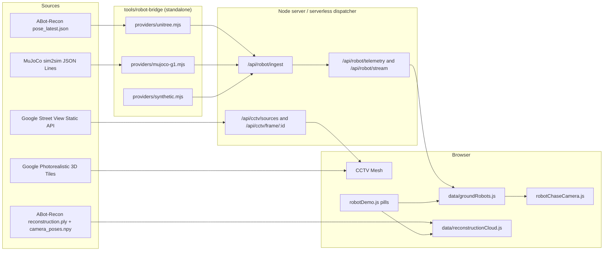
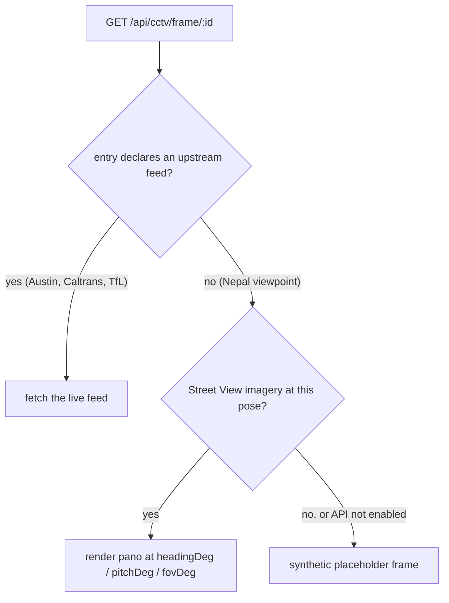
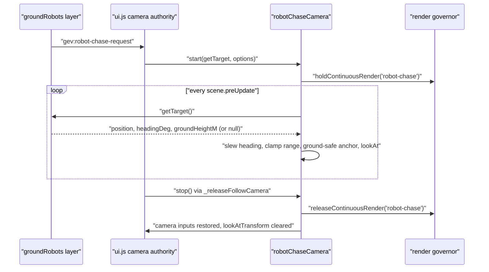
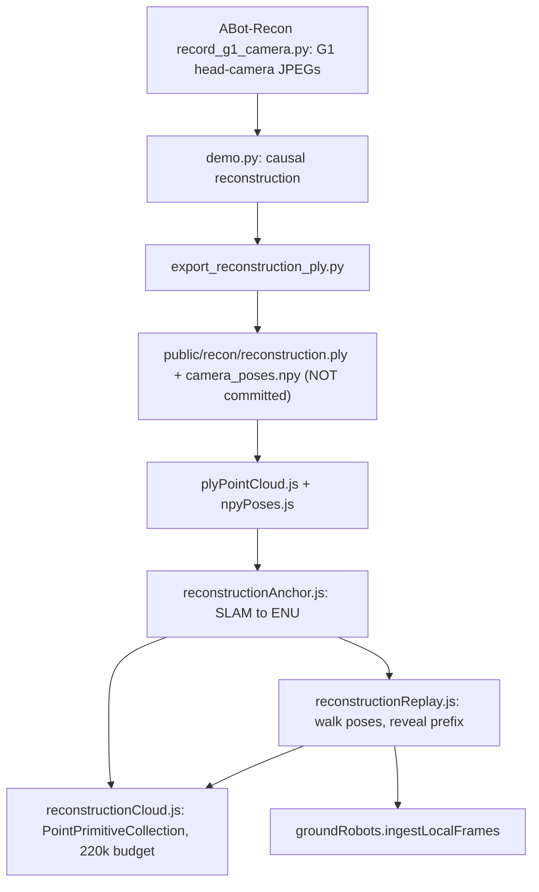
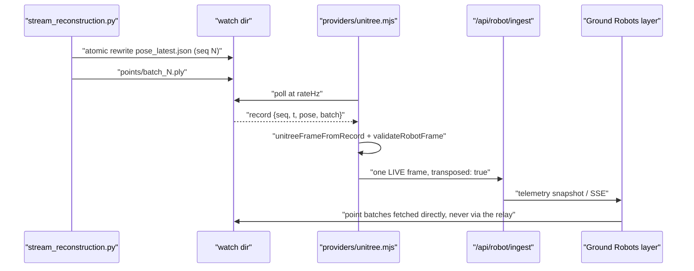
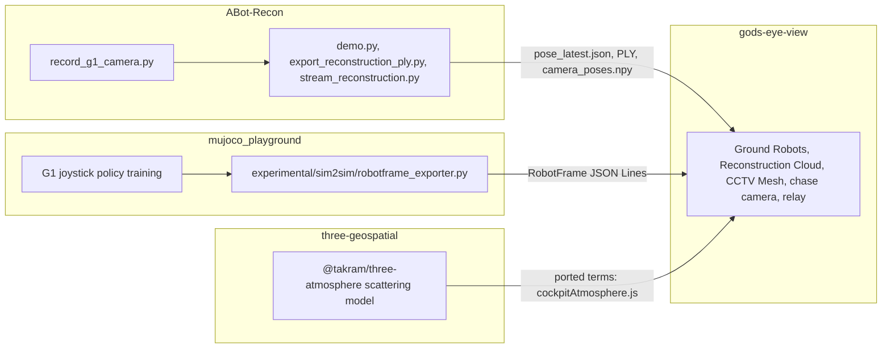

# Fo Guang: Buddha's Light #savenepal — Technical Architecture

Companion to [`../README-savenepal.md`](../README-savenepal.md) (mission framing)
and [`CURRENT-STATE.md`](CURRENT-STATE.md) (the authoritative runtime reference
for the base project). This document owns the architecture, the invariants, and
the honest limits of the disaster-response stack layered onto God's Eye View.

Two documents already own adjacent ground and are not restated here:
[`ROBOT-THIRD-PERSON-SPEC.md`](ROBOT-THIRD-PERSON-SPEC.md) (robot layer
architecture and phases) and
[`GOAL-KHUMBU-TRANSPOSITION.md`](GOAL-KHUMBU-TRANSPOSITION.md) (transposition
and live-robot bring-up).

---

## 1. What the stack is

God's Eye View is a browser-based real-time 3D globe: vanilla JavaScript,
CesiumJS, Google Photorealistic 3D Tiles, a Vite dev server that also serves a
key-brokering `/api/*` proxy layer, and one module per live data layer. The
#savenepal stack adds four capabilities inside that existing shape rather than
beside it — a viewpoint pack that merges into the existing CCTV catalog, two
data layers, one bridge provider, and a set of pure normalization modules.



---

## 2. Nepal street-level viewpoint pack

### 2.1 The problem it solves

The CCTV Mesh is what makes a city look surveilled — camera frusta projected
into the 3D scene. All three live packs (Austin Open Data, Caltrans, TfL
JamCams) are city APIs, and the nearest of them to the Rasuwagadhi flood
corridor is London, 7,285 km away. Nepal has no ingestable public camera
network. The design decision is therefore explicit: **ship viewpoints, not
cameras**, and let the existing frame route degrade into imagery.

### 2.2 How it composes with the existing catalog

`loadNepalViewpointPack()` in `server/proxies.js` reads
`config/cctv_sources.nepal.json` (77 entries) and **merges** into
`/api/cctv/sources` alongside the live packs — unlike `CCTV_SOURCES_FILE`,
which replaces them. Entries carry no `url` and no `snapshotUrl`, so
`/api/cctv/frame/:id` tries the upstream feed, finds none, and falls through to
the Street View fallback it already had, rendering the panorama at the entry's
`headingDeg` / `pitchDeg` / `fovDeg`. **No client change was required.**



### 2.3 Coverage and pose derivation

| Run | OSM ref | Spacing | `cityId` | Entries |
| --- | --- | --- | --- | --- |
| Kathmandu Ring Road | `NH39` | 350 m | `kathmandu` | 59 |
| Pasang Lhamu Highway, Betrawati to Rasuwagadhi | `NH18`, `29A005` | 1,200 m | `rasuwagadhi` | 18 |

`scripts/build-cctv-pack-nepal.mjs` samples the road runs from OSM geometry and,
per candidate:

1. probes the Street View **metadata** endpoint (unbilled) and drops anything
   not `OK`, so the committed pack never claims a viewpoint whose imagery does
   not exist;
2. snaps the entry onto the panorama's own coordinates;
3. takes `headingDeg` from the local road tangent;
4. reads ground elevation from Open-Meteo, so the projected cone lands on the
   carriageway instead of under the terrain.

It aborts on `REQUEST_DENIED`: the Street View Static API is a separate API
from Maps JavaScript and Map Tiles and must be enabled on the same GCP project.

### 2.4 Invariants pinned by tests

`src/data/nepalViewpointPack.test.mjs` holds six properties: the pack ships and
is usable; every viewpoint is inside Nepal's bounding box with a valid heading,
a finite ground elevation, and a negative pitch (looking down the road, not at
the sky); no entry declares a feed URL, and every entry is
`feedType: 'image'` / `poseSource: 'curated'`; ids are unique so the catalog
merge cannot silently drop one; both road runs are represented; and the catalog
cap keeps operator-configured cameras ahead of the Nepal pack, and the Nepal
pack ahead of the live packs. `CCTV_NEPAL_ENABLED=0` empties the pack without
touching the live packs.

### 2.5 Cost and attribution

Frames are billed Street View Static requests against `GOOGLE_MAPS_API_KEY`,
one per camera refresh, throttleable with `GEV_RATELIMIT_GOOGLE_PER_MIN`. Each
entry carries `license: "Imagery © Google — Street View Static API"` plus its
`imageryDate`, both surfaced in the camera card. Without the API enabled the
frames degrade to the same synthetic placeholder any unreachable camera gets.

---

## 3. Ground Robots: a humanoid as a live layer

### 3.1 RobotFrame v1 — one contract, three runtimes

`src/data/robotFrame.js` is pure and Cesium-free so it runs identically in the
browser, the Vite dev server, and Node test runners. It is the single shape
spoken by the bridge, the relay, and the layer.

| Field | Contract |
| --- | --- |
| `v`, `id`, `t` | version `1`; id matches `/^[0-9a-z~_-]{1,16}$/`; `t` within ±24 h of server time |
| `pose` | `lat`, `lon`, `altM` finite and in range; `headingDeg` / `pitchDeg` / `rollDeg` finite or explicitly null |
| `datum` | one of `wgs84-ellipsoid`, `egm96-orthometric`, `agl`, `slam-local` |
| `fix` | `source` in `gnss`, `rtk`, `slam`, `fused`, `dead-reckoned`; accuracies finite or null |
| `gait` | FSM in `damp`, `stand`, `walk`, `run`, `squat`, `sit`, `unknown`; cadence, stride, and optional policy `phase` |
| `vel`, `power` | finite-or-null speed and course; `soc` bounded to 0–100 |
| `provenance` | `source` in `live-g1`, `phone`, `replay`, `synthetic`; **`label` must equal the label for that source**; `confidence` in [0, 1] |

Two design choices carry most of the weight:

- **Provenance is validated, not decorative.** A frame whose `label` disagrees
  with its `source` is rejected. A sender cannot quietly stamp synthetic data
  `LIVE`, because the mismatch is a schema error.
- **A batch is rejected whole.** `validateRobotFrameBatch` performs no
  malformed-prefix salvage, so a partially-corrupt sender cannot poison the
  relay with the good half of its output.

Limits: ≤200 frames per POST, ≤600 frames per robot ring (~60 s at 10 Hz), ≤16
robots, 256 KB body cap on ingest.

`toEllipsoidHeightM()` is where the datum earns its place: `slam-local` and
`agl` altitudes resolve **only** when a local ground height is supplied, and
return `null` otherwise — a reconstruction-derived altitude can never be
silently treated as an ellipsoid height.

### 3.2 Layer behaviour

`src/data/groundRobots.js` renders frames as a shared billboard collection with
bounded 5-fix histories, rendering one telemetry interval behind wall clock and
interpolating between real fixes (`src/data/robotMotion.js`). Past the newest
fix it **coasts a bounded amount and then freezes** — a stale robot never
drifts into fiction. Ground height comes from the cached ground snap only,
never a per-frame `sampleHeight`, and the snap is validated against the
*rendered* surface (see the 2026-08-30 entry in `CURRENT-STATE.md`).

The layer never moves the camera. Selection announces
`requestWorldFocus({kind: 'robot'})`; chase entry is announced via
`gev:robot-chase-request` and `ui.js` owns the claim, so the single-writer
camera rule holds.

### 3.3 Chase camera

`src/robotChaseCamera.js` follows a layer-supplied target getter from
`scene.preUpdate` — never `preRender`, because the camera must be posed before
the scene updates.



Defaults: 6 m range clamped to 2–40 m, −15° pitch, 60°/s yaw slew, 1.0 m eye
height above the feet, 1.2 m ground clearance. A `null` target skips the frame
rather than snapping. The governor hold is symmetric on every exit path — a
leaked hold costs the entire idle frame budget, which is why
`scripts/qa-robot-chase.mjs` asserts zero holders after exit.

### 3.4 Gait animation

`src/data/robotGaitPose.js` poses the bundled `unitree-g1.glb` by rotating
named glTF nodes. Because the export keeps the MuJoCo body hierarchy and link
names and every posed joint is a pitch joint, the whole solver rotates about
one local axis. Angles are clamped to the Menagerie `unitree_g1` MJCF limits.

This is the deliberate seam: **the wire format carries a gait FSM, a cadence,
and optionally the policy's own stride phase — never 23 joint angles.** The
renderer integrates cadence locally when no phase arrives. The reason is the
ingest budget (§3.1): ~23 joints × 2 arrays per frame would push whole batches
past the 256 KB cap and get them rejected outright. The animation is a readable
walk cycle, not a physics replay, and the honest place for a richer joint
channel is a separate one.

### 3.5 In-browser demo and degraded relay

`src/robotDemo.js` installs two top-center pills. **▶ G1 DEMO** runs the
deterministic walker from `src/data/robotSyntheticWalker.js` at 10 Hz entirely
in the browser — no bridge, no relay, so it works on static and serverless
deploys — enables the layer, streams frames through
`groundRobotsLayer.ingestLocalFrames()` (the same `acceptFrame` path as relayed
telemetry), engages the chase after ~12 accepted frames, and shows a live
telemetry panel. The walker is deterministic by `(seed, tick)`: the same seed
replays the same walk, with scripted slip / comms-dropout / carried windows.
The bridge's synthetic provider delegates to the same generator, so the demo and
the bridge cannot diverge.

Degraded hosts are handled as a distinct state rather than an error: where no
persistent process exists, `/api/robot/telemetry` answers
`503 {"status":"unsupported"}`, the layer records `relayUnsupported` (exposed in
`getStats()`), closes the SSE stream, and stops the 1 Hz re-poll. No spurious
`LOAD FAILED` chip, local frames unaffected, and a later successful snapshot
clears the flag.

---

## 4. Reconstruction replay (DISASTER RECON)

### 4.1 Pipeline



The browser parses the exporter's `binary_little_endian` PLY (skipping its
`edge` element) and the `[N,4,4]` camera-to-world pose array **directly from the
asset URL**, not through the relay: a decimated cloud still exceeds the 256 KB
ingest cap. Points are decimated to a 220,000 point-primitive budget (one
`PointPrimitive` per point costs CPU on every collection update), drawn at 3 px
with a 0.05 m lift so they do not z-fight terrain. The marker then walks the
pose track while the cloud reveals the matching prefix, so the map grows as the
robot walks it.

### 4.2 The anchor, and why it is editorial

ABot-Recon's world frame is the first camera's frame, in metres, with `+x`
right, `+y` **down**, `+z` forward (the OpenCV-style camera convention its
poses and point maps share). A reconstruction is therefore metric but has **no
georeference at all**, and placing it on Earth is an editorial act.
`config/recon/g1-anchor.json` supplies that act explicitly: `lat`/`lon` of the
clip's first frame, `headingDeg` the compass bearing that first camera looked
along, `elevM` a ground-relative offset.

`slamToEnu()` rotates a SLAM point into the anchor's local ENU frame:

```text
eastM  =  z·sin(heading) + x·cos(heading)
northM =  z·cos(heading) − x·sin(heading)
upM    = −y
```

The result rides on the `slam-local` datum — a ground-relative offset on top of
a terrain snap — and the replay stays `SIMULATED · VIRTUAL TRANSPOSITION` on
every surface. Recorded geometry, chosen place, never live hardware.

### 4.3 Assets are not committed

`reconstruction.ply` and `camera_poses.npy` are session artifacts sized in tens
to hundreds of megabytes and are **not in the tree**;
[`../public/recon/README.md`](../public/recon/README.md) documents the exact
commands that produce them. Without them the pill reports `NO RECONSTRUCTION
PUBLISHED` and changes nothing else — the absent-asset path is a first-class
state, not a crash.

---

## 5. Live bridge and simulation providers

### 5.1 Unitree provider — "live" without an incremental model

ABot-Recon's `infer()` runs one full causal pass per call; it is not an
incremental generator. So "live" is defined honestly:
`scripts/stream_reconstruction.py` reconstructs rolling windows of frames a
recorder is filling, stitches each pass's fresh local frame onto the previous
(already-stitched) poses, and atomically rewrites `pose_latest.json` plus
chunked point batches. `tools/robot-bridge/providers/unitree.mjs` polls that
file (rename-atomic writes make a poll race-free) and emits **one frame per new
`seq`**.



Behavioural contracts worth keeping:

- **Fail at startup, not per-frame.** A bad anchor file or an out-of-range
  confidence throws when the provider is created, because a typo that rejects
  every frame is a miserable thing to learn about later.
- **Absent is not an error.** `pose_latest.json` does not exist until the first
  window completes; `ENOENT` counts as `unreadable` and latches no error.
- **Unchanged `seq` is not a frame.** Re-reading the same record counts as
  `unchanged`, so the layer sees no duplicate fixes.
- **Status is derived, not asserted.** `getStatus()` reports `down` with no
  timer, `stale` past 15 s of frame age, else `live`.
- **Read-only by construction.** The only input is a directory of files; no
  controller is ever registered. Nothing in the provider can reach the robot.

`src/data/unitreeTelemetry.js` does the normalization (pure, Cesium-free, shared
with the tests): rotates the SLAM pose into ENU, offsets it from the anchor,
derives heading from the pose's forward vector, and stamps `LIVE` provenance
with `transposed: true` — **the motion is real, the geolocation is an editorial
choice, and both statements are in the frame.**

### 5.2 MuJoCo sim2sim provider

`mujoco_playground`'s `experimental/sim2sim/robotframe_exporter.py` writes JSON
Lines; `src/data/mujocoTelemetry.js` folds them into canonical frames. It
accepts two shapes, because a sim harness is exactly where someone wires up a
leaner record than the wire format: a canonical `v: 1` frame (passed through,
with the bridge — not the sim — overriding id and provenance), or a flat sim
record (`lat`/`lon`/`altM`/`fsm`/`phase`/…) folded into one here.

Two details that are easy to get wrong and are therefore pinned in code:

- **Velocity comes from the policy's own observation.**
  `velFromPelvisLinvel()` takes `local_linvel_pelvis` — forward `+x`, left
  `+y` — and rotates it into the robot's heading; heading grows clockwise, so
  the leftward drift angle is *subtracted* to get course.
- **The line reader is byte-budgeted, not character-budgeted.** The stream
  decodes to UTF-16, so a record of CJK labels or degree signs costs two to four
  bytes per unit; `createLineReader` measures UTF-8 bytes, drops an oversized
  logical line **whole** (one bad record must not sink a whole ingest batch),
  and resynchronizes on the next newline if a sender never emits one.

The raw policy observation — joint angles, velocities, gravity — is deliberately
not forwarded, for the same 256 KB reason as §3.4.

---

## 6. Cockpit atmosphere, ported from three-geospatial

`src/cockpitAtmosphere.js` ports the atmospheric terms of
[three-geospatial](https://github.com/gratitude5dee/three-geospatial)'s
`@takram/three-atmosphere` (Bruneton-style precomputed scattering) *in spirit*
for the cockpit cloud pass consumed by `src/cockpitCloudEffects.js`:

| Helper | What it computes |
| --- | --- |
| `solarPositionDeg` | Solar elevation/azimuth via the NOAA low-precision equations (better than a quarter degree, which the cloud pass cannot see) |
| `cockpitSunDirection` | Sun direction in the pass's view frame (+x right, +y up, +z along the cockpit heading) |
| `solarAirMass` | Relative air mass, Kasten & Young 1989, horizon-safe |
| `cockpitSunIrradiance` | Closed-form Rayleigh transmittance along that air mass: reddened direct term, Rayleigh-blue ambient term |
| `cockpitAerialPerspective` | Altitude-dependent inscatter and extinction weights, both falling off as the air column above the camera thins |

**The port is deliberately partial and the reason is architectural:** Cesium
still owns the sky and the terrain, and these helpers shade only a transparent
overlay — so the expensive LUT textures of the full Bruneton model are replaced
with closed-form approximations over an approximated air mass. Rayleigh
coefficients (5.8e-6, 13.5e-6, 33.1e-6 per metre) and the 8 km scale height are
the published sea-level values.

---

## 7. Innovations, stated plainly

1. **Absence of a feed is a design input, not a failure.** The Nepal pack is
   the load-bearing example: a curated pose plus a fallback renderer produces
   useful street-level context in a country with no ingestable camera network,
   and the resulting entity is honestly typed (`streetview-viewpoint`,
   `poseSource: 'curated'`) rather than dressed up as a camera.
2. **One validated wire contract across four runtimes.** RobotFrame v1 is the
   same shape in the browser, the Vite dev server, the standalone bridge, and
   Node tests — with provenance validated as part of the schema. A synthetic
   demo, a MuJoCo rollout, and a live G1 stream reach the globe through
   identical code, which is why the demo path cannot silently diverge from the
   live one.
3. **Georeferencing as an explicit editorial act.** A SLAM reconstruction has
   no georeference; rather than hiding that, the stack names the anchor file,
   the datum (`slam-local`), and the chip (`VIRTUAL TRANSPOSITION`).
4. **Streaming defined against the model's real behaviour.** Since `infer()` is
   not incremental, "live" became rolling windows stitched into one persistent
   frame, published through atomic rewrites and consumed one `seq` at a time —
   an honest architecture instead of an incremental illusion.
5. **Read-only by construction, at every layer.** No controller in the
   provider, no `camera.flyTo` in the data layers, `POST /api/robot/command`
   answering 501 by default and rendering no control affordance. The property
   is structural, so it does not depend on anyone remembering it.
6. **Degradation states are enumerated.** `NO RECONSTRUCTION PUBLISHED`,
   `relayUnsupported`, `stale` bridge status, frozen (not drifting) stale
   robots, placeholder camera frames: each failure has a specific,
   distinguishable surface.
7. **Budgets are part of the design.** A 220k point-primitive cap, a 256 KB
   ingest cap that shaped what telemetry the wire carries, a render governor
   hold that must be released symmetrically, and an unbilled metadata probe in
   the pack generator.

---

## 8. Real-world impact — and its limits

What this stack genuinely provides today, for a Nepal flood or quake scenario:

- **Corridor situational context without local infrastructure.** 77 posed
  street-level viewpoints along the Kathmandu Ring Road and the Rasuwagadhi
  flood corridor, projected into a photorealistic 3D globe, in a country with
  no public camera API — usable for briefing, route familiarization, and
  before/after framing.
- **A rehearsal environment for robot-assisted reconnaissance.** A humanoid's
  real gait, IMU, and power telemetry can drive a marker over the real terrain
  of a place it has never been, with the geography labelled as staged — so a
  team can rehearse an operating picture before hardware ever ships.
- **A recorded-geometry map that grows as the robot walks it.** An ABot-Recon
  reconstruction of a head-camera clip replayed on the globe is a concrete
  artifact of what a walking sensor produced, anchored where an operator says it
  belongs.
- **A cheap, inspectable foundation.** One required API key, no framework, MIT
  licence, and every layer a pattern that can be repointed at another country's
  data.

And the limits, stated as flatly:

- **Street View imagery is not a live feed.** It is dated (each entry carries
  its `imageryDate`) and says nothing about current conditions. A flood corridor
  rendered from 2022 panoramas shows the road as it was.
- **No robot has been moved by this stack, and none can be.** The command
  endpoint is disabled, the live bring-up (`GOAL-KHUMBU-TRANSPOSITION.md` W1+)
  has not started, and the physical e-stop is the e-stop.
- **The reconstruction assets are not in the repository**, so out of the box the
  DISASTER RECON pill has nothing to replay.
- **Transposed positions are staged.** Route progress under transposition
  integrates gait rather than geographic translation, and is labelled
  accordingly.
- **This is not an emergency-response system.** God's Eye View's own notice
  applies in full: data may be delayed, incomplete, modeled, inferred, or wrong,
  and must not be used for safety-critical decisions. Treat this stack as a
  foundation for building something that could be validated for that — never as
  the validated thing.

---

## 9. The four repositories



- **[gods-eye-view](https://github.com/gratitude5dee/gods-eye-view)** — the
  globe, layers, relay, viewpoint pack, chase camera, demo pills.
- **[ABot-Recon](https://github.com/gratitude5dee/ABot-Recon)** — G1
  head-camera recording (read-only: it subscribes to an image topic and never
  commands the robot), reconstruction, PLY/pose export, and the rolling-window
  streamer the live bridge tails. CPU inference is supported (`--device cpu`,
  optional `--quantize`) for boxes without a GPU.
- **[mujoco_playground](https://github.com/gratitude5dee/mujoco_playground)** —
  G1 locomotion policies and the sim2sim RobotFrame exporter.
- **[three-geospatial](https://github.com/gratitude5dee/three-geospatial)** —
  the physically-based atmospheric model the cockpit cloud pass borrows from.

---

## 10. Gates

Docs-only changes still ride the project's gates. For anything touching the code
described above: `npm test` (the unit suite auto-discovers `*.test.mjs` under
`src/`, including `nepalViewpointPack`, `robotFrame`, `robotMotion`,
`robotTransposition`, `robotRelay`, `robotChaseCamera`), `node
scripts/qa-perf.mjs`, `node scripts/qa-firstrun.mjs`, `node
scripts/track-regression.mjs`, and `scripts/qa-robot-chase.mjs` for the chase
camera. Upstream: `python -m pytest
mujoco_playground/experimental/sim2sim/robotframe_exporter_test.py -q` in
`mujoco_playground`, `pytest -q` in ABot-Recon.
